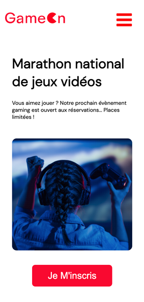

# Project 4 "GameOn" from React JS Application Developer Training: 
Create a landing page with JavaScript

 
##
Skills developed:
- Programming in JavaScript
##
Start the project: 
Nothing to install here, just open the index.html file.
##
To view the page online click  :point_right: [here](https://cla31.github.io/GameOn-website-FR/#)
##
Application overview  (in desktop version):
 
 

 
 
Application overview (in mobile version):
 
 

